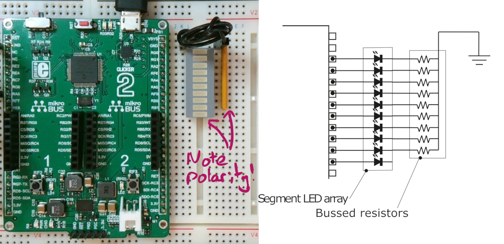
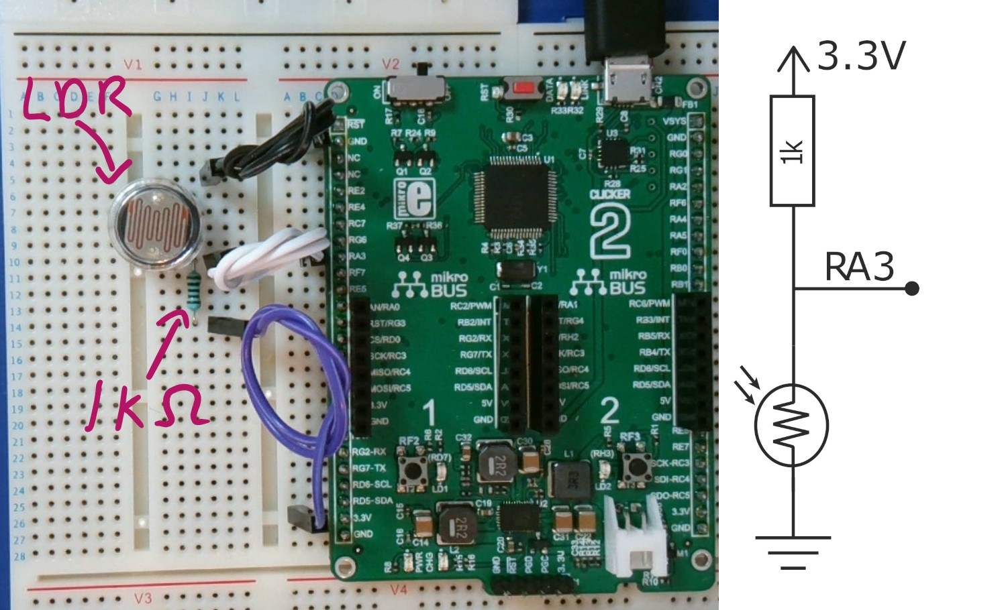

# Lab 2 - Digital and analogue IO

## Learning outcomes

This lab session will further your understanding of digital IO and introduce analogue input. At the end of this lab you should be able to:
- Manipulate binary data to format a number for display on an LED array
- Use a variable to count button presses and display the current count
- Sample an analogue voltage and display the result
- Use functions and header files to achieve more complicated tasks and enable you to re-use code

## Further digital IO
In the first lab session we controlled the 2 LEDs that are onboard the clicker2 board. We will now go further an use C to manipulate binary values in order to control an array of LEDs and display numerical values. 

### Connecting LED array
Connect the LED array and bussed resistor as shown below. LED's need to be connected the correct way around, the anode side is indicated by a small chamfer on the corners of the array. Whilst single resistors are not polarised, bussed resisters have a common terminal which all resistors in the package are connected to. This terminal is indicated by a dot and should be connected to ground.

### Lighting LEDs
In the first lab session we used some code to flash an LED. In order to do this we first needed to configure it as an output pin. This is done by clearing (writing 0) the appropriate bit in the TRIS (data direction) registers. For example, to make pin RD7 an output we used:

    TRISDbits.TRISD7 = 0;

We can then control whether the pin is high (3.3V) or low (0V) by writing to the LAT (output latch) registers. For example, to set pin PD7 high we use:

    LATDbits.LATD7 = 1;
	
The principle is the same with any pin and we can use the same method to turn on LEDs in the LED array.

### Testing bits in variables
There are several ways to find out if a particular bit in a variable is set (1) or clear (0). One of the more intuitive ways is to use an *if* statement and a bit mask. For example, if we wanted to test if the 4th bit in a variable was set we could do the following:

    if (number & 0b00001000) {do something;} else {do something different;}
    
The *&* symbol is called the "bitwise and" operator. Each bit in *number* is individually tested against the corresponding bit in the bit mask. Here we have specified the bit mask in binary by using the *0b* prefix. Note this is purely for the programmers convenience, it is exactly the same as writing:

	if (number & 8) {do something;} else {do something different;}
	 

### Recognising button presses
To recognise a button press we must do two things. The first is to set the pin to be an input pin. We can do this by turning on the appropriate bit in the TRIS (data direction) registers. For example, to make pin RF7 an input we may use the following.

    TRISFbits.TRISF7 = 1;

The second step to recognising a button press is to read the state of the pin. For example the following code will check the current state of pin RF7 and increment the variable counter if it is high (1).

    if(PORTFbits.RF7) {counter++;}
	
(Note, RF7 is not connected to the button on the clicker2 board)
	
### Organising programs using header and source files
Whilst it is possible to create programs with one big source file, it quickly becomes unmanageable and it is better to organise your code into separate files. C provides a method of doing this using header files and source files. A header file (.h) contains mainly declarations (code that tells the compiler that something exists), i.e. function prototypes , #define statements, structure declarations, among other things. Source files (.c) contain mainly definitions, i.e. function definitions (the actual function code) and can be compiled separately to other source files. A source file can be given access to a function in a different file by including the header file where that function is declared.

    # "myHeaderFile.h"
	
Note that the quotes here are used instead of <> to tell the compiler to look in the current directory, rather than the compilers standard library of header files. In the source file where a function is defined, the corresponding header file where that function in declared must be included with a #include. 
This all sounds more complicated and involved than it really is, it is best learnt by example. The exercises in this lab make use of header files to organise functions associated with controlling the LEDarrry (LEDarray.c and LEDarray.h) and using the ADC module (ADC.c and ADC.h). Organising your code in this way has the additional benefit of making it easy to reuse of your tested functions in other programs, without having to start from scratch or maintain multiple versions of the same function.

## Exercise 1 - Further digital IO
Remeber to Commit your code after each task is completed and push the changes back to github.

1. Clone this repository and make a new MPLAB project using the procedure outlined in lab 1. Add files main.c, LEDarray.c and LEDarray.h to the project and complete the LEDarray_init() and LEDarray_disp_bin() functions in LEDarray.c to display the software counter value on the LED array in binary.
1. Modify the code in the main() function to scan the LED back and forth along the array, in a similar fashion to KITT’s grill from the TV series Knight Rider (http://www.youtube.com/watch?v=Mo8Qls0HnWo). (For the uninitiated, Knight Rider was a 1980s TV series about a crime fighter Michael Knight played by David Hasselhoff, aka “The Hoff”, and his artificially intelligent car KITT.)
1. Make a new function to initialise input from the button connected to RF2 and modify the main() function to count the number of button presses and display the current count on the LED array in binary.
1. Modify the code so that it continuously increments the counter if the button is held down for more than approximately 500 ms (and increments just once if it isn’t held down). 
1. Complete the LEDarray_disp_dec() function in LEDarray.c to display the current count on the LED array in factors of 10 (i.e the first LED is lit when the count is >= 10, the second LED is lit when the count is >= 20 etc). Call this function from main().

## Analogue input
The PIC contains a 10 bit analogue to digital converter (ADC). In this section we will use a light dependent resistor (LDR) in potential divider arrangement to produce a voltage between 0V and 3.3V on pin RA3. 

### Connecting the LDR
Connect the LDR and 1k resistor as shown below. There is no polarity to observe.

In the dark, with no light falling on the LDR, the LDR resistance is very high and the voltage at the pin is close to 3.3V. With intense light on the LDR the resistance drops and the voltage at the pin approaches 0V. Anything in-between will result in a voltage somewhere between these two extremes, which can be sample by the PIC's ADC module and converted to a 10-bit digital value.

### Setting up the ADC hardware module
Analogue input is slightly more complicated than digital input. There are more than 30 registers in the PIC that are used to configure analogue to digital conversion, but don't panic, we only need to configure a few to get things working. The main registers are: 

Register | Function
---------|---------
ADCON0 | Basic control settings for ADC
ADREF | Configures the reference voltage sources (i.e. min/max voltage) for the ADC module
ADPCH | Selects the channel (pin) to be sampled and converted to a 10 bit number 
ANSELx | Configures on which pins the analogue input circuitry is active (note this active on all analogue pins by default!)
ADRESH/L | Register pair were the result of the conversion is stored

ADCON0 contains bits that control the way in which the A to D conversion is performed, such as whether the ADC is performed on demand or repeated continuously, the clock source for performing the conversion and how the result is formatted. It is also used to start a conversion and let the program know that ADC has completed a conversion.  ADREF defines the minimum and maximum reference voltages for the conversion. The ADC result is stored in the ADRESH/L register pair. In left aligned mode, the 8 most significant bits (MSBs) are stored in ADRESH, and the remaining 2 bits are stored in ADRESL. Section 32 of the PIC18F67K40 data sheet contains a complete description of all registers and bits in the ADC module.

The first step to analogue to digital conversion is setting which pins will be used. The following code sets pin AN7 as an input and activated the analogue input circuitry (disables digital input)

    TRISAbits.TRISA7=1;
    ANSEL7bits.ANSELA7=1; 
	
References voltages can then be configured with:

    ADREFbits.ADNREF = 0;  // Use Vss (0V) as negative reference
    ADREFbits.ADPREF = 0b00; // Use Vdd (3.3V) as positive reference
	
This sets up the ADC to use 0V as the negative reference, and 3.3V as the positive reference. An input voltage of 0V will result in 0 being stored in the ADRES register pair. An input voltage of 3.3V will result in 1023 being stored in the register pair (i.e. 2^10 - 1). The appropriate channel is set with ADPCH before final configuration and enabling with:

	ADCON0bits.ADFM = 0; // Left-justified result (i.e. no leading 0s)
    ADCON0bits.ADCS = 1; // Use internal Fast RC (FRC) oscillator as clock source for conversion
    ADCON0bits.ADON = 1; // Enable ADC

### Using the ADC
The ADC is now ready to start a conversion. To initiate a conversion the GO bit is set:

    ADCON0bits.GO = 1;

When the conversion finishes this bit is automatically set to 0 by hardware. To access the result we simply read from the ADRESH/L register pair.

## Exercise 2 - Analogue input

1. Add the ADC.c and ADC.h files to your project (they should already be in your project directory) and use the functions provided to read the LDR voltage and display the result on the LED array in binary (don't forget to include the header file!)
1. Instead of displaying the result in binary on the LED array, display the result in a linear, intensity meter, type fashion (similar to the LEDarray_disp_dec() function above). Calibrate the display so that ambient light lights all the LEDs and putting your thumb over the LDR light should reduce the number of LEDs lit to zero.

## Exercise 3 - Peak power meter
1. Complete the LEDarray_disp_PPM() function and extend your previous code to create a peak power meter effect for displaying LDR readings on the LED array. Your code will need to keep track of the peak value from the last second and display that alongside the current value on the LED array. The peak value stored should reduce by 1 LED every 1 second until the current value exceeds it and new peak value is stored. This will produce the same effect as seen on some volume meter on audio equipment (see http://www.youtube.com/watch?v=-jhkAw3Y7lM). 
