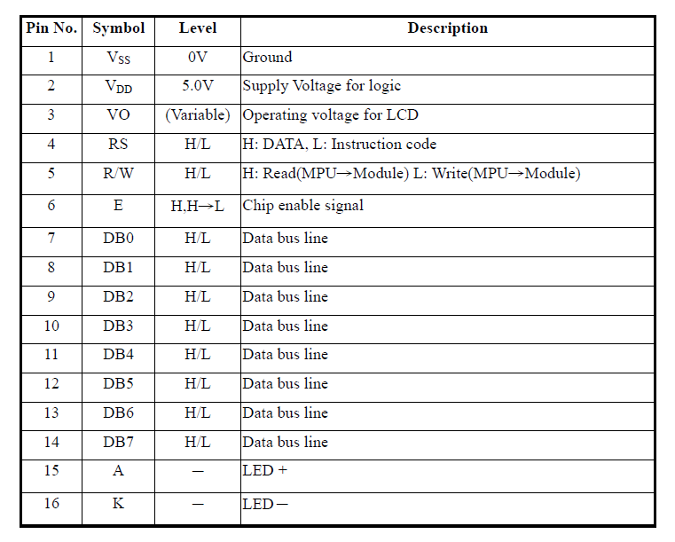
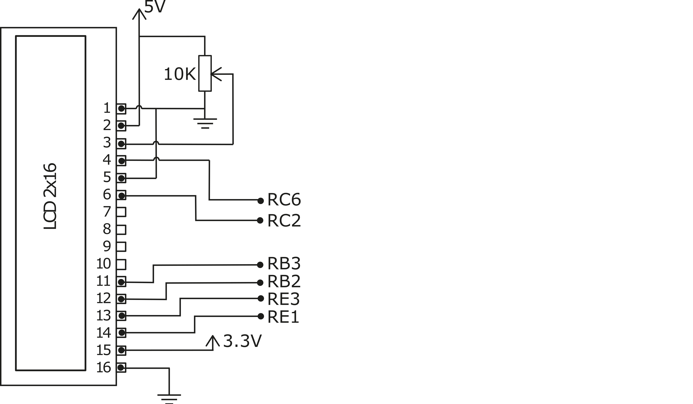
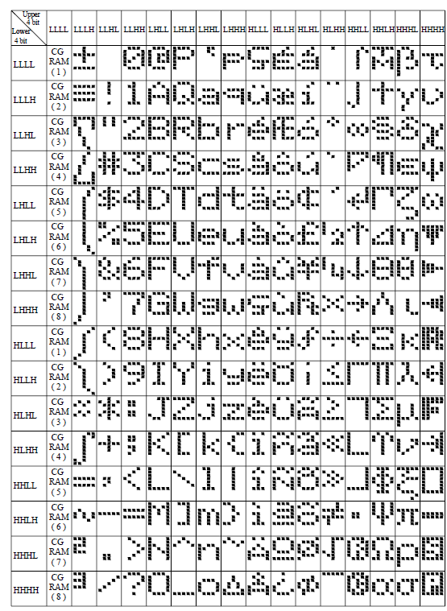

# Lab 4 - LCD and pointers

## Learning outcomes

In this lab session we will learn to drive an LCD screen using our PIC microcontroller and a 4 bit parallel interface. After this lab you should be able to:

- Understand the operation of a parallel interface to control an LCD screen
- Initialise the LCD screen into 4 bit mode
- Write characters and strings to the LCD
- Shift the display to scroll a message
- Create a voltmeter and simple animation/game 

###	Electrical connections for the LCD
The LCD screen is a HD44780 compatible device (one of the most popular character LCD screens ever made) and can be driven with 8 data lines, or, to save on I/O pins, 4 data lines. The following table shows the pin-out for the LCD screen.

The following diagrams shows the connections that need to be made to interface the screen with the PIC MCU. There is also a video tutorial on MS Teams taking you through how to do this using the solder-less breadboard.

###	LCD initialisation and instructions
The following pictures give the basic information (taken from the data-sheet) you need to control the LCD screen. The flow chart below shows the procedure for initialising the LCD screen. This needs to be done before the LCD screen can be used.  

The picture below details the different commands you can send to the LCD for setup, control and to send data (i.e. text) to the LCD screen.

The following extract from the data-sheet shows the list of characters that can be displayed on the LCD screen. This list is ASCII compatible (at least for the western characters), meaning the bits representing a character that are stored in a char variable are the same as the bits that need to be sent to the LCD. This greatly simplifies writing characters to the LCD screen.

## Exercise 1. LCD "Hello world!"

1. After wiring up your LCD screen clone the GitHub repo, create your MPLAB x project and add all the .c and .h files to your project. Complete the functions in LCD_E_TOG, LCD_sendnibble, LCD_sendbyte, LCD_setline and LCD_Init functions and get your LCD working.

## Strings and pointers

Sending each character separately as above is effective but hardly efficient coding! It is much better to use pointers to look at a sequence of characters. The following function uses a pointer to output a string of characters to the LCD screen.

	void LCD_sendstring(char *string)
	{	  
		while(*string != 0){  // While the data pointed to isn’t a 0x00 do below (strings in C must end with a NULL byte) 
			LCD_sendbyte(*string++,1); 	//Send out the current byte pointed to and increment the pointer
		}
	}

## Exercise 2. LCD and strings

1.	Implement the LCD_sendstring() function to output the “Hello World!” string.
1.	Write a message to both lines of the LCD screen.
1.	Each line of the display can store up to 40 characters in memory (although only 16 are displayed at once).  Write a long message to the screen and complete and use the LCD_scroll() function (refer to the command table) to the LCD to make the message scroll across the screen.

## Dynamic strings

Dynamic strings are those created on-the-fly during program execution and are stored in the data memory by default. One example of when these are required is when displaying the voltage from the ADC on the LCD screen.  The most convenient way of converting numbers to a string is to use the printf family of functions contained in the stdio.h header file. The sprintf function is used to create a formatted string that is stored in a data memory buffer. The printf functions generally have at least three arguments, the first is where to store the result, the second is the format string and arguments thereafter are the variables which need to be converted. In the example below the “%d” in the format string is a format specifier and tells the function how to format the variable x. Each variable passed to the function needs a format specifier (otherwise it will be ignored) and the variables are interpreted in the order they are given.

	int x=256;
	//this function replaces %d with 256 and stores the result in buf
	sprintf(buf,"x = %d",x);
	LCD_String(buf); //"x = 256" is displayed on the LCD

More information about the format specifiers supported can be found in the XC8 documentation and other general C documentation. One problem when using the printf functions with floating point format specifiers is the large amount of program memory that these routines need. In fact, with the standard free version of the XC8 compiler, the printf function becomes too large to fit in the program memory when used with floating points. The solution is to write our own function to do the formatting.
To convert an ADC result to a decimal number with a fractional part, you need to convert the number into two integers, one for the integer part of the number and one for the fractional part. For example, to convert an **8 bit ADC** result out of a maximum **5 volts** to a decimal number with two decimal places the conversion would follow these steps:

First calculate the integer part. Scale the ADC result so it is out of 5 and the result is rounded down to the nearest integer

	int_part=ADC_result/51; // i.e. 255 / 5V = 51
	
Second calculate the fractional part. Multiply the ADV_result by 100 before dividing to keep 2 more significant figures. Then subtract int_part\*100 to get only the fractional part (number after the decimal place)

	frac_part=(ADC_result*100)/51 - int_part*100;

Then display the result. Remember to include leading zeros in the fractional part, (%02) means 2 figures with leading zeros

	sprintf(buf,"%d.%02d",int_part,frac_part);
	
Remember that the ADC on our board has a reference voltage of **3.3 V**, the above numbers depend on this and the number of bits in the ADC result.
	
## Exercise 3. Dynamic strings and voltmeter

1.	Use the ADC to monitor the voltage of the LDR and output the 8 most significant bits of the ADC result on the LCD as a decimal integer (i.e. out of 255).
1.	Convert the ADC result to volts (maximum 3.3V) and display it as a decimal number to two decimal places (the sprintf in the function in the XC8 compiler does not work with floats, see above).  

## Exercise 4. Animation challenge!

1.	Create a picture, animation or simple game on the LCD screen using either the basic built-in character set or custom characters. Please keep them clean! Hint: If you want to make up new characters the LCD's controller can store up to 8 custom characters. In the data-sheet look at the Character Generator RAM section and Table 1 to see how to create your own characters.
