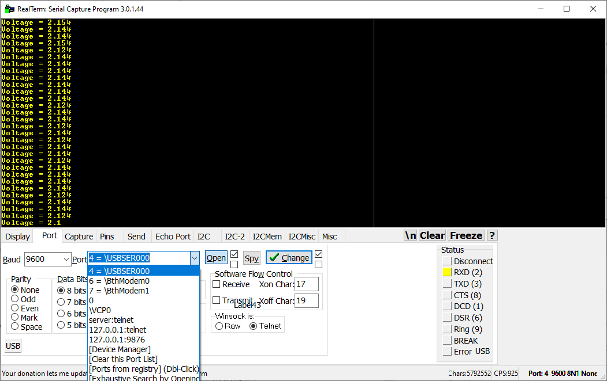
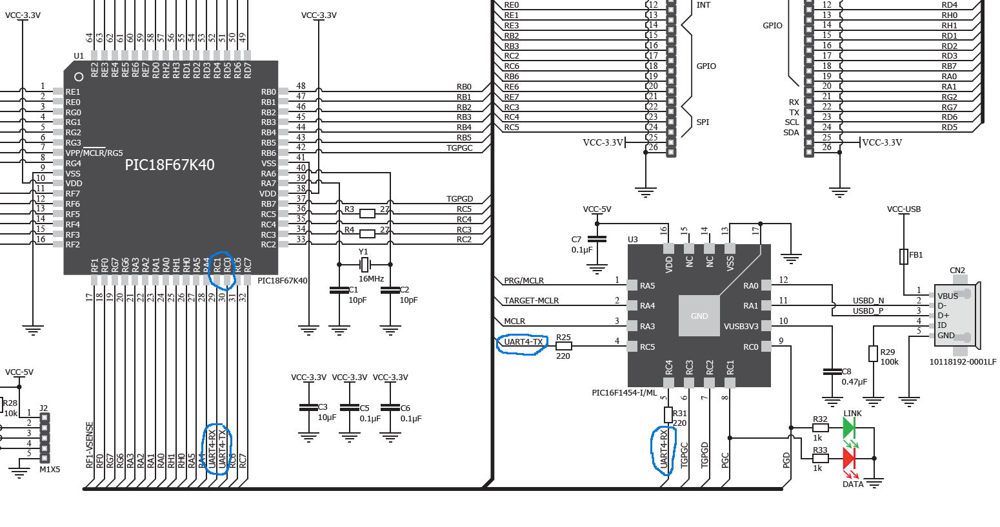
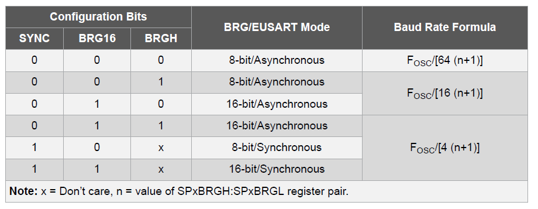
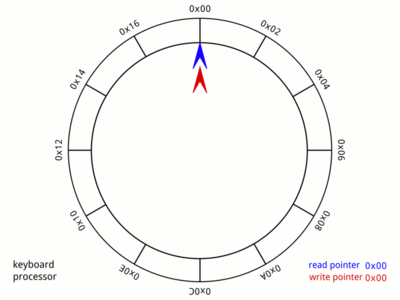

# Lab 5 - Serial communication

## Learning outcomes

This lab session introduces the Enhanced Universal Synchronous Asynchronous Receiver Transmitter (EUSART) module in the PIC chip and communication between the PIC and a PC using a serial port over USB interface. The lab covers the following:

-	Setting up the EUSART module
-	Transmitting data from the PIC to the PC
-	Receiving data from the PC
-	Creating a simple protocol to enable sending of commands and data

### Serial terminal software

On the computer side we will need to use serial terminal software to send and receive data to/from the PIC. Download and install appropriate software for your system below:

**Windows** - https://realterm.i2cchip.com/Realterm_3.0.1.44_setup.exe

**MAC** - https://pbxbook.com/other/mac-ser.html
	
**Linux** - You already know what to do...

Since most users will be working from Windows we will focus on RealTerm. The serial port can be set up from the Port tab as shown below and settings are updated when the Change button is clicked. The Baud should be 9600 to start with and no partity, 8 data bits and 1 stop bit. In this case the USB Serial Port for the clicker 2 is on port 4, but it could be any number. If you want to check what the number should be on your system open up Device Manager in Windows and look under "Ports (COM & LPT)". You are looking for the item called "USB Serial Port (COMx)" where x is the port number.

 
Text and raw bytes in decimal and hexadecimal can be sent from the Send tab. The Display tab allows you to change how you view the data received over the serial interface (as text or as hexadecimal or both!).

###	Serial over USB

EUSART modules cannot communicate directly with a serial port or USB port on a PC without additional hardware. Fortunately the clicker 2 board contains an additional chip (a PIC16F) that acts as a virtual serial port and enables us to communicate with a PC without us needing to do any additional wiring. Our PIC is connected to this chip via pins RC0 and RC1, which can be mapped to the EUSART 4 module. This is shown in the clicker 2 manual and in the diagram below:

The PIC18F67K40 contains re-mappable pins for certain peripherals using the Peripheral Pin Select Module (PPS). This allows you to choose which pins are used for a peripheral module. To configure EUSART4 to use pins RC0 and RC1 we need to following code:

    RC0PPS = 0x12; // Map EUSART4 TX to RC0
    RX4PPS = 0x11; // RX is RC1   
 
Further details of this configuration are in section 17 of the datasheet. TRIS values for transmission are automatically configured when the PPS and EUSART module is enabled. The TRIS value for the RX pin must be set to input in your code (it is input by default).

###	Setting up the EUSART

We will set up EUSART 4 to send/receive data asynchronously to/from the PC. To do this we need to set up three configuration registers; the transmit status register TX4STA, the receive status register RC4STA and the BAUD4CON register. The default mode is 8 data bits with no parity bit, the only things we need to configure are the baud rate, the enable transmit/receive bits and the enable continuous receive bit. The table below gives the baud rate generator equation (where n is the register pair SP4BRGH:SP4BRGL that we need to set) for different configurations.
 
 
 
The following code sets up the EUSART the baud rate to 9600 using a 8 bit baud rate generator value (BRG16 and BRGH are both low).

	BAUD4CONbits.BRG16 = 0; 	//set baud rate scaling
    TX4STAbits.BRGH = 0; 		//high baud rate select bit
    SP4BRGL = 103; 			//set baud rate to 103 = 9600bps
    SP4BRGH = 0;			//not used
    
    RC4STAbits.CREN = 1; 		//enable continuos reception
    TX4STAbits.TXEN = 1; 		//enable transmitter
	RC4STAbits.SPEN = 1; 		//enable serial port
	
### Receiving data

Once the EUSART has been set up, received bytes can be read from the receive register RCREG. When a full byte has been received, the receive interrupt flag RCIF is set in the PIR1 register. The flag is cleared automatically when RCREG is read. The EUSART module has very little buffering, so to avoid losing bytes RCREG needs to be read immediately. The function below waits for a byte to be received and then returns the received byte. This function will work satisfactory when the time between function calls is short compared to the time between receiving bytes (i.e. it is already in the wait loop when the next byte is received). If time between function calls is long, then an interrupt service routine will be needed to buffer the incoming serial data bytes.

	char getCharSerial4(void) {
		while (!PIR4bits.RC4IF);//wait for the data to arrive
		return RC4REG; //return byte in RCREG
	}

## Exercise 1: Serial "Hello world!"

1. Clone the GitHub repo and use the above code to program your PIC chip to accept characters from the PC and print them to the LCD screen.
1. Recalculate and set the baud rate generator value for a baud rate of 19200.
 
###	Sending data
Transmitting data is achieved by writing to the transmit register TXREG. Data in the TXREG is copied within one instruction cycle to the transmit shift register (TSR) where it is sent out serially one bit at a time, with appropriate start and stop bits. The transmit interrupt flag TXIF is set in the PIR1 register when the data byte has been copied from TXREG to the TSR. It therefore indicates that the next byte to transmit can be written to TXREG. The TXIF is set low when TXREG is written to. The following function sends a byte of data out over the serial interface. 

	void sendCharSerial4(char charToSend) {
		while (!PIR4bits.TX4IF); // wait for flag to be set
		TX4REG = charToSend; //transfer char to transmitter
	}

## Exercise 2: Sending data from the PIC to a PC

1. Extend the code from Exercise 1 to also “echo” characters sent from the PC back to the RealTerm program.
1. Complete the sendStringSerial4() function to send light level readings from the LDR formatted as text in volts from the PIC to the PC every second.
1. Do you notice any problems when you send multiple characters for display on the LCD screen? (this will depend on how you have programmed you PIC to send the data every second)

### Interrupts

Whilst the above functions work, they are a very inefficient way to implement serial communication since the functions wait for characters to arrive or be sent. This means the CPU is continuously checking and is not free to perform other tasks. A much better way to program this would be to use interrupts. We have already used the interrupt flags in the above functions when polling to see if there is data in the receive/transmit registers, but we have not enabled these as interrupt sources. To do this we need to configure the interrupt enable bits for this EUSART module:

	PIE4bits.RC4IE=1;	//receive interrupt
	PIE4bits.TX4IE=1;	//transmit interrupt (only turn on when you have more than one byte to send)
	
This is in addition to the usual configuration of the global interrupt enable, etc bits.

One difference with the interrupt flags for EUSART modules is that they cannot be cleared by writing to them. The only way to clear the RC4IF is to read the data in RC4REG. Once the data is read, the flag will clear. In a similar fashion the TX4IF for the transmit register is set whenever the TX4REG is empty. This is useful when you have more than one byte of data to send as it will notify you as to when to write the next byte to TX4REG. If you no longer wish to send data over the EUSART, you will need to turn off the TX4IE bit to stop interrupts triggering until you are ready to send more data.

Note the receiver has a 2 byte first in first out buffer, so 2 bytes can be received whilst the receive register is waiting to the read. 2 bytes isn't very many and if more than 2 are received then bytes sent over the serial interface will be dropped and the overrun error bit OERR in RC4STA will be set. Note that no further data will be received until this bit is cleared by software.

### Circular buffers

Buffering incoming or outgoing streams of data is best achieved with circular buffers (also called ring buffers). Circular buffers consist of some reserved memory (say an array of 20 bytes), a variable that stores the start of data, and variable that store the end of the data. The end of data lets the program know where the write the next byte into the buffer and the start of data indicates where the data should be read out from the buffer. This makes the buffer a First-In First-Out (FIFO) buffer. This is shown pictorially in the animation below.

It is useful to make functions to put data into the buffer and get data out from the buffer. These functions automatically update the start and end markers for the buffer and take care of resetting them to the beginning when they reach the end of the reserved memory space. This makes the operation of the buffer easy and robust. There are some simple functions to enable you to use circular buffers with your serial communication in the provided serial.c/h files in the GitHub repo.

## Exercise 3: Interrupt driven serial communication

1.	Make a new branch on GitHub for your new and improved interrupt driven serial communication code.
1. 	Convert your existing code to work on a interrupt driven basis. Received data bytes are read from RC4REG only when an interrupt occurs and data for transmission is only copied into the TXREG once a transmission of the previous byte is complete. The circular buffer functions provided in serial.c/h should be used to move data between your main code and your ISR.
1. Once you are happy with your code and have tested it thoroughly,  merge it back into the master branch.

### Further information: packets, data and commands

When communicating with a device we often want it to do different things at different times. We might want to tell it to display some characters on the LCD or we might want it to send some values from the LDR to the PC. To achieve this type of functionality we need to define a protocol for communication where we can send commands and data to/from the PC.

The American Standard Code for Information Interchange (ASCII) defines 128 characters, 33 of which are non-printing control characters. We could use these control characters to help our PIC interpret the data that it is receiving. For example, if we wanted to send a command for the PIC to interpret we might use the start of header byte (0x01) and 0xFF to indicate that we are about to send it a command. We can use the end of transmission byte 0x04 to indicate that a transmission is complete. This block of data forms a simple data packet. For example, we might use the following sequence of bytes to tell the PIC to send an LDR reading over the serial interface, where 0xF0 means "send the LDR reading over serial" in our protocol.

Start packet | Instruction | "Send LDR val" | End packet
---------|---------|---------|---------
0x01 | 0xFF | 0xF0 | 0x04

If we want to send text for display on the LCD we could use the bytes 0x02 and 0x03 indicate the start and end of a block of text respectively.  For example to send “hello” we would send:

Start packet | Start text | 'h' | 'e' | 'l' | 'l' | 'o' | End text | End packet
---------|---------|---------|---------|---------|---------|---------|---------|---------
0x01 | 0x02 | 0x68 | 0x65 | 0x6C | 0x6C | 0x6F | 0x03 | 0x04

It is entirely up to you how define a protocol, these are just examples of how you might do so.

## Optional exercise: Low power data logger

1. Use a timer to take a LDR sample every second and save to an array in RAM, your code should maintain a record of the last 60 readings from the LDR.
1. Use the EUSART to wake the device when a control character sequence is received (of your choosing) send all readings (up to 60) taken since the PC last requested the readings. 
1. Define a second control character sequence to instruct the PIC to send just the current LDR reading the to PC.

